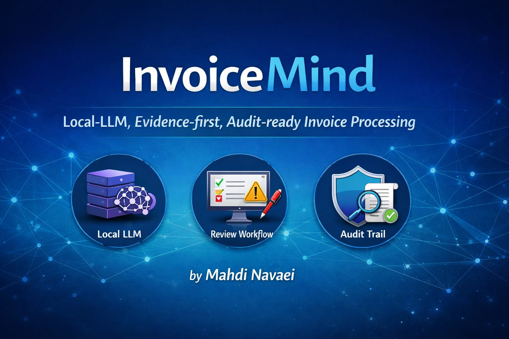
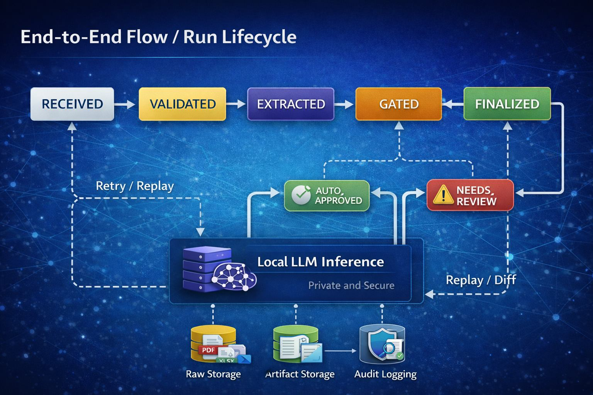
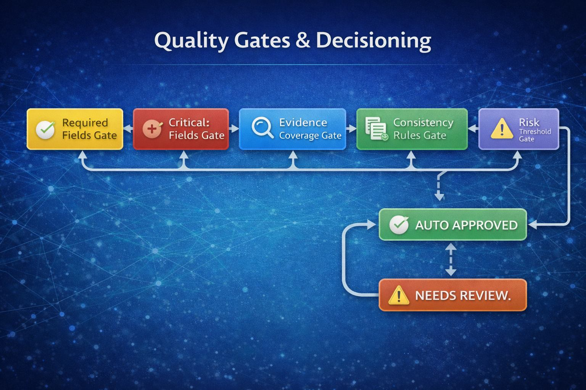

<div align="center">

# InvoiceMind

### Local-LLM, Evidence-First, Audit-Ready Invoice Processing



A production-oriented bilingual (English/Persian) platform for invoice extraction, human review, and governance-safe automation.

[](https://python.org)
[](https://fastapi.tiangolo.com)
[](https://nextjs.org)
[](https://www.typescriptlang.org)
[](LICENSE)

</div>

---

## TL;DR for Reviewers

InvoiceMind demonstrates how to build a production-style financial document workflow around local LLMs with:

- explicit quality gates instead of blind automation
- human-in-the-loop review and quarantine
- replayable lifecycle and audit-ready event logs
- evaluation-aware and policy-driven decisioning

---

## Why InvoiceMind?

Most invoice AI systems fail in production not because of OCR alone, but because automation decisions are hard to trust, hard to explain, and hard to control.

InvoiceMind is built to solve this operational gap:

- **Decision traceability**: why was a run auto-approved or escalated?
- **Controlled automation**: when should the system refuse auto-approval?
- **Operational safety**: replay, quarantine, and explicit reason codes
- **Bilingual operations**: practical workflows for FA/EN teams

## The Problem InvoiceMind Solves

Invoice processing with LLMs breaks at the governance layer before it breaks at raw extraction quality.

Common production failure patterns:

- untraceable approval decisions
- confidence-only routing without policy checks
- missing containment for low-quality inputs
- no replayability for post-incident analysis

InvoiceMind addresses these as first-class design requirements, not afterthoughts.

---

## Design Principles

- Local-first inference (privacy before scale)
- Evidence before confidence
- Policy-driven automation
- Replayable and auditable runs
- Safe defaults over aggressive automation

## What InvoiceMind Is NOT

- Not an OCR benchmark project
- Not a generic prompt demo
- Not an ERP replacement
- Not designed for blind fully automated posting

---

## Implementation Status

| Area | Status |
|---|---|
| Core extraction pipeline | ✅ Implemented |
| Review UI and quarantine flow | ✅ Implemented |
| Audit trail and replay controls | ✅ Implemented |
| Quality gates and policy routing | ✅ Implemented |
| Evaluation and Gold Set workflow | 🧪 Sample implementation |
| Calibration and risk scoring | 🟡 Baseline implemented, tuning ongoing |
| Capacity and change governance | 🟡 Baseline implemented, expansion planned |

Status legend:

- ✅ Implemented in current codebase
- 🧪 Implemented as sample/evaluation workflow
- 🟡 Implemented foundation with planned hardening

---

## Research-Informed Foundations

InvoiceMind design choices are aligned with current public guidance on trustworthy AI operations and secure LLM deployment:

- NIST AI RMF 1.0 (Govern, Map, Measure, Manage): https://www.nist.gov/publications/artificial-intelligence-risk-management-framework-ai-rmf-10
- NIST AI RMF Generative AI Profile: https://www.nist.gov/publications/artificial-intelligence-risk-management-framework-generative-artificial-intelligence
- OWASP Top 10 for LLM Applications: https://owasp.org/www-project-top-10-for-large-language-model-applications/
- GitHub README guidance (structure, discoverability, relative assets): https://docs.github.com/en/repositories/managing-your-repositorys-settings-and-features/customizing-your-repository/about-readmes

## Related Open Source Landscape

InvoiceMind takes inspiration from adjacent OSS ecosystems while focusing on financial-governance-safe workflows:

- docTR (OCR stack and document parsing patterns): https://github.com/mindee/doctr
- InvoiceNet / invoice2data (invoice extraction baselines): https://github.com/naiveHobo/InvoiceNet, https://github.com/invoice-x/invoice2data
- Langfuse (LLM observability mindset for production systems): https://github.com/langfuse/langfuse

---

## Visual Walkthrough

### 1) System Architecture


Core flow:

`Ingestion -> Validation -> OCR/Layout -> LLM Extraction -> Postprocess -> Routing -> Review -> Export`

Architecture highlights:

- storage isolation (`raw`, `runs/artifacts`, `audit`, `quarantine`)
- local runtime with versioned config bundles
- governance endpoints for runtime/version/risk visibility

### 2) End-to-End Run Lifecycle



Primary states:

`RECEIVED -> VALIDATED -> EXTRACTED -> GATED -> (AUTO_APPROVED | NEEDS_REVIEW) -> FINALIZED`

Control points include cancel/replay and explicit escalation paths.

### 3) Review Workbench


Review UX supports:

- queue-based triage
- field-level confidence and evidence context
- correction and comparison workflows

### 4) Quality Gates and Decisioning



Gate categories include:

- required fields
- critical field validation
- evidence coverage
- consistency checks
- risk thresholds

### 5) Quarantine and Data Quality


Quarantine is reason-code-driven and reprocessable, so failures are contained rather than silently accepted.

### 6) Evaluation and Gold Set


Evaluation outputs support field-level and document-level analysis, including tradeoffs between review pressure and critical error risk.

---

## Known Failure Modes (By Design)

InvoiceMind explicitly detects and contains high-risk failure classes such as:

- low-quality scans and weak OCR confidence
- missing required or critical fields
- unsupported currency or consistency violations
- schema-breaking or evidence-poor outputs

These cases are routed to quarantine or review, never silently auto-approved.

## Automation Philosophy

Automation is allowed only when:

- required fields are present and valid
- critical checks pass
- evidence coverage is sufficient
- consistency rules hold
- risk thresholds are not exceeded

Otherwise, the system defaults to human review.

## Operational Guarantees

- Every decision is traceable to gate results and reason codes
- Every run can be replayed for deterministic investigation
- Every runtime behavior is version-aware (model/prompt/policy/routing/template)
- Every failure path is explicit (review or quarantine)

---

## How InvoiceMind Differs From Typical LLM Pipelines

| Typical LLM Invoice Tool | InvoiceMind |
|---|---|
| Confidence-only automation | Policy and gate-based routing |
| Blind extraction output | Evidence-aware decisioning |
| Weak operational replay | Explicit replay/cancel lifecycle |
| Limited auditability | Audit verify/events endpoints |
| Cloud-first assumptions | Local-first deployment strategy |

---

## Demo Scenario (5 Minutes)

1. Upload a low-quality invoice sample.
2. Observe validation outcome and quarantine reason code.
3. Reprocess after configuration adjustment.
4. Review extracted fields with evidence and gate outcomes.
5. Finalize and export with audit traceability.

---

## Tech Stack

### Backend

- Python 3.11+
- FastAPI
- SQLAlchemy + Alembic
- SQLite (default)

### Frontend

- Next.js 16 (App Router)
- React 19
- TypeScript (strict)

### Runtime and Config

- versioned runtime bundles in `config/`
- model registry in `models.yaml`
- local storage roots for raw, runs, quarantine, and audit artifacts

---

## Quick Start

### Prerequisites

- Python `3.11+`
- Node.js `22+`
- npm

### One-click startup (Windows)

```bat
run.bat
```

Services:

- Backend: `http://127.0.0.1:8000`
- Frontend: `http://127.0.0.1:3000`

### Manual startup

Backend:

```powershell
python -m pip install --upgrade pip
python -m pip install -r requirements.txt
python scripts/migrate.py
python -m uvicorn app.main:app --host 127.0.0.1 --port 8000
```

Frontend:

```powershell
cd frontend
npm install
npm run dev -- --hostname 127.0.0.1 --port 3000
```

---

## Local LLM Setup

InvoiceMind is built for local inference workflows.

1. Create backend env from template:

```powershell
Copy-Item .env.example .env
```

2. Configure runtime versions and model settings:

- `INVOICEMIND_MODEL_VERSION`
- `INVOICEMIND_MODEL_RUNTIME`
- `INVOICEMIND_MODEL_QUANTIZATION`
- `INVOICEMIND_PROMPT_VERSION`
- `INVOICEMIND_TEMPLATE_VERSION`
- `INVOICEMIND_ROUTING_VERSION`
- `INVOICEMIND_POLICY_VERSION`

3. Keep large model weights outside Git; store metadata in `models.yaml`.

Optional GGUF runtime example:

```powershell
ollama import <path-to-gguf> --name invoicemind-extractor
ollama run invoicemind-extractor --prompt "extract invoice fields"
```

4. Configure frontend API bridge:

```powershell
Copy-Item frontend/.env.local.example frontend/.env.local
```

Set:

- `INVOICEMIND_API_BASE_URL`
- `INVOICEMIND_API_USERNAME`
- `INVOICEMIND_API_PASSWORD`

---

## API Surface (Main)

- `GET /health`
- `GET /ready`
- `GET /metrics`
- `POST /v1/auth/token`
- `POST /v1/documents`
- `GET /v1/documents/{document_id}`
- `POST /v1/documents/{document_id}/runs`
- `GET /v1/runs/{run_id}`
- `POST /v1/runs/{run_id}/cancel`
- `POST /v1/runs/{run_id}/replay`
- `GET /v1/runs/{run_id}/export`
- `GET /v1/quarantine`
- `GET /v1/quarantine/{item_id}`
- `POST /v1/quarantine/{item_id}/reprocess`
- `GET /v1/audit/verify`
- `GET /v1/audit/events`
- `GET /v1/governance/runtime-versions`
- `POST /v1/governance/change-risk`
- `POST /v1/governance/capacity-estimate`

---

## Quality and Test Commands

Backend:

```powershell
pytest
```

Frontend:

```powershell
cd frontend
npm run typecheck
npm run test
npm run build
```

---

## Architecture Decisions

The following decisions define current system direction:

- **ADR-001**: Local-first inference for financial documents
- **ADR-002**: Evidence-first extraction over confidence-only routing
- **ADR-003**: Policy-driven gates over implicit model thresholds

---

## Repository Layout

```text
InvoiceMind/
├─ app/                    # backend services, orchestration, API
├─ frontend/               # Next.js bilingual operations UI
├─ config/                 # versioned model/prompt/template/policy/routing bundles
├─ scripts/                # migration and utility scripts
├─ tests/                  # backend test suites
├─ tools/                  # performance and benchmark tools
├─ assets/readme/          # README visual assets
├─ Docs/README.md          # unified technical documentation
├─ run.bat                 # Windows one-click startup
├─ LICENSE                 # AGPL-3.0
└─ SECURITY.md             # vulnerability reporting policy
```

---

## Future Work

- stronger calibration with larger and more diverse Gold Sets
- tighter reviewer-feedback loop into evaluation cycles
- deeper multi-tenant isolation and governance hardening
- richer observability export and dashboarding

---

## License and Security

- License: `AGPL-3.0` (`LICENSE`)
- Security Policy: `SECURITY.md`

---

This project reflects how production financial LLM workflows should be engineered, not just prototyped.
